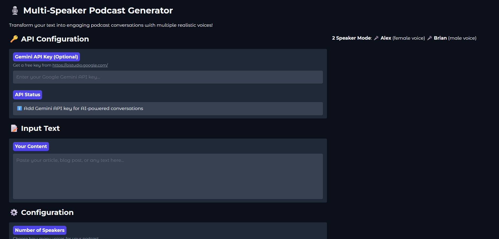

# 🎙️ PodcastAgent - Multi-Speaker Podcast Generator

Transform your text into engaging podcast conversations with multiple realistic AI voices! PodcastAgent uses advanced text-to-speech technology to create natural-sounding multi-speaker podcasts from any written content.



## 🌟 Features

- **Multi-Speaker Conversations**: Generate podcasts with 1-4 different AI voices
- **Realistic Voices**: Uses Microsoft Edge TTS for natural-sounding speech
- **AI-Powered Script Generation**: Leverage Google Gemini to create engaging conversations
- **Multiple TTS Engines**: Choose from Edge TTS, gTTS, or pyttsx3
- **Easy Download**: Download your generated podcasts as audio files
- **Web Interface**: User-friendly Gradio interface
- **Real-time Processing**: Watch your podcast being generated step by step

## 🎭 Speaker Configurations

| Speakers | Configuration | Voices |
|----------|---------------|---------|
| **1 Speaker** | Solo narration | Single voice |
| **2 Speakers** | Host conversation | Alex (female) & Brian (male) |
| **3 Speakers** | Panel discussion | Sarah (female), Mike (male) & Emma (female) |
| **4 Speakers** | Full roundtable | Sarah, Mike, Emma & David (male) |

## 🚀 Quick Start

### Prerequisites

- Python 3.8+
- FFmpeg (for audio processing)

### Installation

1. **Clone the repository**
   ```bash
   git clone https://github.com/hari7261/PodcastAgent.git
   cd PodcastAgent
   ```

2. **Install dependencies**
   ```bash
   pip install -r requirements.txt
   ```

3. **Run the application**
   ```bash
   python app.py
   ```

4. **Open your browser**
   Navigate to `http://localhost:7860`

## 🔧 Configuration

### API Setup (Optional but Recommended)

1. **Get a Gemini API Key**
   - Visit [Google AI Studio](https://aistudio.google.com/)
   - Create a free API key
   - Paste it in the "Gemini API Key" field in the app

2. **Benefits of API Key**
   - Natural conversation generation
   - Intelligent speaker distribution
   - Context-aware dialogue

## 📝 Usage

1. **Enter your content** - Paste any text (articles, blogs, stories)
2. **Configure speakers** - Choose 1-4 speakers for your podcast
3. **Select voice engine** - Edge TTS recommended for multi-speaker
4. **Generate** - Click the button and wait for processing
5. **Download** - Save your podcast as an audio file

### Example Input

```
Renewable energy is transforming our world. Solar panels are becoming more efficient, 
wind farms are expanding offshore, and battery storage is solving intermittency issues. 
The convergence of these technologies is creating unprecedented opportunities for clean energy.
```

### Example Output (2 Speakers)

```
Alex: The renewable energy boom is incredible, right? Solar's plummeting costs are game-changing.

Brian: Absolutely! And offshore wind farms are revolutionizing energy generation. Those massive turbines can power entire cities.

Alex: It's not just generation; storage is key. Lithium-ion batteries are getting cheaper and more efficient every year.

Brian: Exactly. Plus, smart grids are optimizing energy distribution in real-time. The whole ecosystem is evolving rapidly.
```

## 🎯 Voice Engines

### Edge TTS (Recommended)
- **Best Quality**: Most natural and realistic voices
- **Multi-Speaker**: Different voices for each speaker
- **Internet Required**: Needs online connection
- **Format**: MP3/WAV output

### gTTS (Google Text-to-Speech)
- **Good Quality**: Clear and understandable
- **Single Voice**: One voice for entire podcast
- **Internet Required**: Needs online connection
- **Format**: MP3 output

### pyttsx3 (System TTS)
- **Offline**: Works without internet
- **Basic Quality**: System-dependent quality
- **Single Voice**: One voice for entire podcast
- **Format**: WAV output

## 🛠️ Technical Details

### Architecture

```
Input Text → AI Script Generation → Multi-Speaker Parsing → TTS Generation → Audio Combining → Output
```

### Dependencies

- **Gradio**: Web interface
- **Google Generative AI**: Script generation
- **Edge-TTS**: Advanced text-to-speech
- **PyDub**: Audio processing
- **gTTS**: Google text-to-speech
- **pyttsx3**: Offline TTS

## 🌐 Online Demo

Try PodcastAgent online at [Hugging Face Spaces](https://huggingface.co/spaces/hari7261/PodcastAgent)

## 📁 Project Structure

```
PodcastAgent/
├── app.py                 # Main application
├── app_simple.py         # Simplified version
├── requirements.txt      # Dependencies
├── README.md            # This file
├── LICENSE              # MIT License
├── demo.png             # Demo screenshot
└── .gitignore           # Git ignore rules
```

## 🤝 Contributing

We welcome contributions! Here's how you can help:

1. **Fork the repository**
2. **Create a feature branch**
   ```bash
   git checkout -b feature/amazing-feature
   ```
3. **Commit your changes**
   ```bash
   git commit -m 'Add amazing feature'
   ```
4. **Push to the branch**
   ```bash
   git push origin feature/amazing-feature
   ```
5. **Open a Pull Request**

### Areas for Contribution

- 🎵 Additional voice options
- 🌍 Multi-language support
- 🎨 UI/UX improvements
- 🔧 Performance optimizations
- 📚 Documentation enhancements

## 🐛 Troubleshooting

### Common Issues

**1. "Edge TTS not available"**
```bash
pip install edge-tts
```

**2. "FFmpeg not found"**
- Windows: Download from [FFmpeg.org](https://ffmpeg.org/download.html)
- macOS: `brew install ffmpeg`
- Linux: `sudo apt install ffmpeg`

**3. "Import Error: numpy"**
```bash
pip install "numpy<2"
```

**4. Audio combining fails**
- Ensure FFmpeg is properly installed
- Check file permissions
- Try using a different TTS engine

### Performance Tips

- Use shorter text inputs for faster processing
- Edge TTS provides best quality but requires internet
- For offline use, choose pyttsx3 engine
- Enable AI script generation for better conversations

## 📊 Performance Benchmarks

| Text Length | Speakers | Processing Time | Quality |
|-------------|----------|----------------|---------|
| 500 chars   | 2        | ~15 seconds    | ⭐⭐⭐⭐⭐ |
| 1000 chars  | 3        | ~25 seconds    | ⭐⭐⭐⭐⭐ |
| 2000 chars  | 4        | ~45 seconds    | ⭐⭐⭐⭐⭐ |

*Note: Times may vary based on internet connection and system performance*

## 🔮 Roadmap

- [ ] **Real-time streaming** - Live podcast generation
- [ ] **Voice cloning** - Custom voice integration
- [ ] **Background music** - Automatic music addition
- [ ] **Emotion control** - Emotional speech synthesis
- [ ] **Multi-language** - Support for multiple languages
- [ ] **API endpoints** - RESTful API for integration
- [ ] **Batch processing** - Process multiple texts at once

## 📄 License

This project is licensed under the MIT License - see the [LICENSE](LICENSE) file for details.

## 👨‍💻 Author

**Hariom Kumar**
- GitHub: [@hari7261](https://github.com/hari7261)
- Hugging Face: [hari7261](https://huggingface.co/hari7261)

## 🙏 Acknowledgments

- Microsoft Edge TTS for amazing voice synthesis
- Google for Generative AI capabilities
- Gradio team for the excellent web framework
- Open source community for continuous support

## ⭐ Star History

If you find this project useful, please consider giving it a star! ⭐

---

**Made with ❤️ for the AI community**

Transform your text into engaging podcasts with PodcastAgent!
